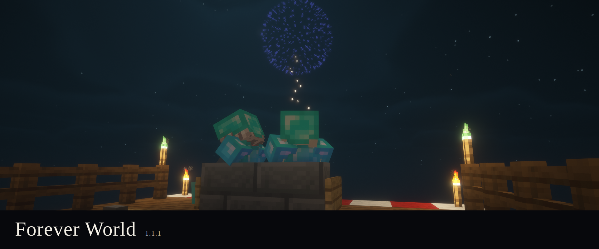
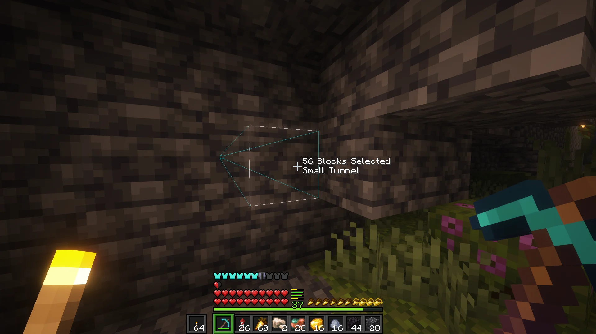
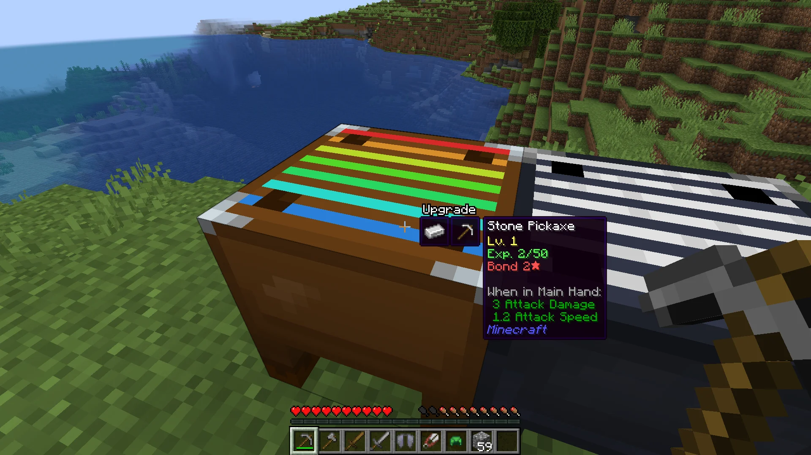
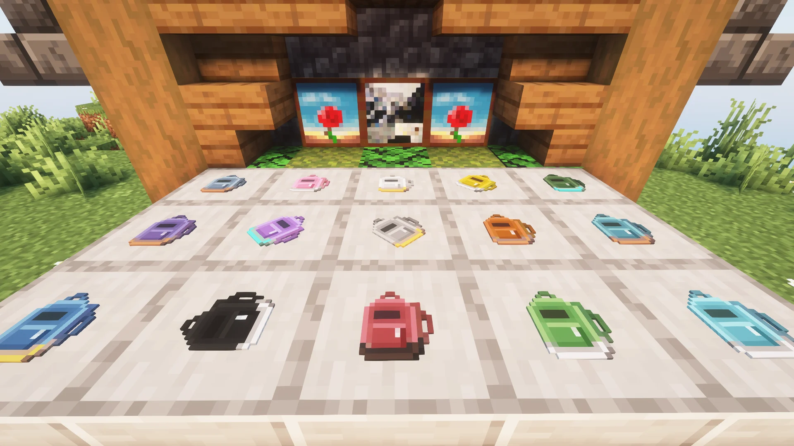
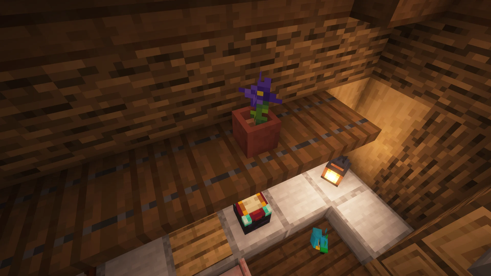
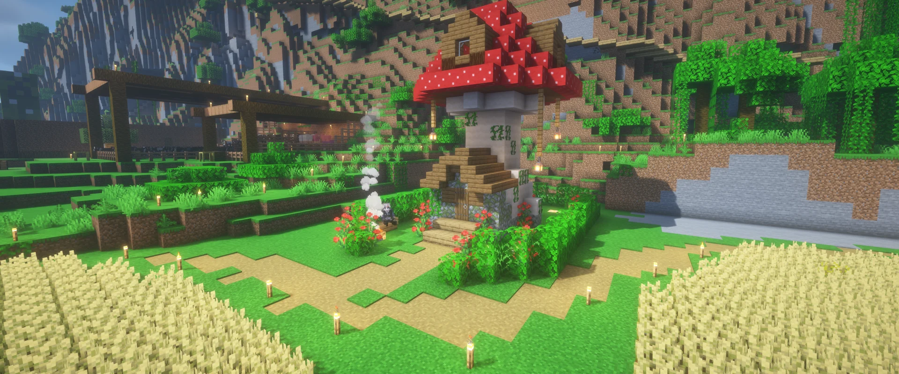
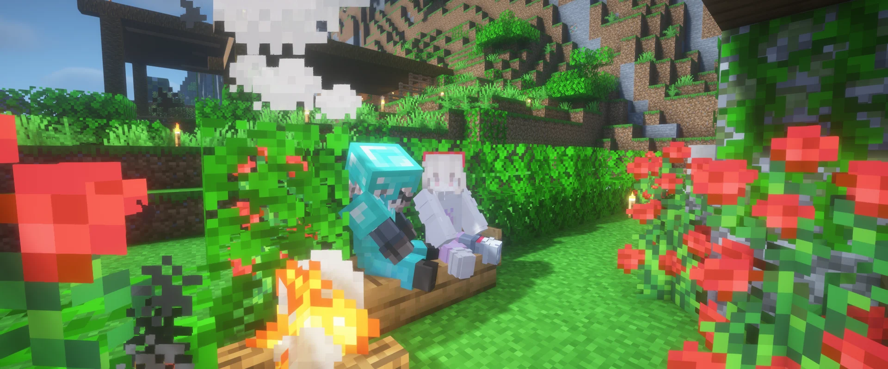

# Forever World



This world does not get thrown away.

Not when the next Minecraft version ships. Not because a shader looks dated. Same chunks, same mistakes, same house. The pack exists so that save still loads.

That is a fucking promise. I can only make it for mods I will still be here to port. So the only content allowed to live in the server's chunks is mine: [Liteminer](https://modrinth.com/mod/liteminer), [Bonded](https://modrinth.com/mod/bonded), [Mochila](https://modrinth.com/mod/mochila), [Torch Toss](https://modrinth.com/mod/torch-toss), [SnapShears](https://modrinth.com/mod/snapshears), [Valentine](https://modrinth.com/mod/kafs-valentine-special), [Kaf HUD](https://modrinth.com/mod/kaf-hud), [Happy Ghast Improvements](https://modrinth.com/mod/happyghastimprovements), [Gentle Hurt Cam](https://modrinth.com/mod/gentlehurtcam). Amber and Konfig because those need them. A backpack in a chest, a repair bench, Aristea in the dirt. The world remembers those, so I have to remember them too. As long as forever is.











Sodium, Iris, Lithium, the sound mods, the shader folder, C2ME, JEI, all of that can come and go. The save does not know they were there. If they vanish we change the pack and keep playing. I will not put anyone else's blocks in this world. I cannot promise those still exist.



The latest published pack is 1.1.1. Minecraft 26.2, Fabric Loader 0.19.3. Java 25 in the launcher.

## Play

Import the [mrpack](https://maven.kaf.sh/com/iamkaf/modpacks/forever-world/1.1.1/forever-world-1.1.1.mrpack) in Prism or whatever else eats Modrinth packs. Complementary Unbound is already in the instance. The CurseForge edition does not include Presence Footsteps because there is no Minecraft 26.2 file for it on CurseForge.

## Host

For a persistent dedicated server, use [Pastel](https://kaf.sh/pastel). It verifies the server files, installs Fabric and Java, and keeps Minecraft running. `just run-server` is for working on this repository. Pastel is for running the published pack.

From an empty server directory:

```bash
curl -fsSL https://kaf.sh/pastel/install.sh | sh
./pastel install com.iamkaf.modpacks:forever-world:1.1.1 -repo https://maven.kaf.sh
./pastel run
```

Pastel leaves client-only files off the dedicated server. Running the server means you agree to [Minecraft's EULA](https://aka.ms/MinecraftEULA).

## Building it

This repo is the source for `com.iamkaf.modpacks:forever-world`. [Swatch](https://github.com/iamkaf/swatch) reads `pack.toml` and prepares the pack. The lockfile records the exact files that were installed, including their hashes and download URLs.

Most entries are one line:

```toml
[client_mods]
sodium = "mc26.2-0.9.1-fabric"
```

`[mods]` loads on both sides. `[client_mods]` stays off the server. `[server_mods]` stays off the client. `[shaders]` contains client shader packs.

```bash
swatch install
just run-client
just run-server
just run-pair
```

`swatch install` resolves and downloads the locked files. The `just` recipes render the pack's Modstage client, server, and pair instances from that lockfile. `just run-pair` starts the local client and dedicated server together for TeaKit checks.

Maintainers need Swatch on `PATH`, or can set `SWATCH_BIN` to its executable.

To check the project without launching Minecraft:

```bash
just check
```

### Versioning

Forever World versions describe what changed in the pack:

- Major: a Minecraft version bump.
- Minor: any mod, resource pack, or shader change.
- Patch: fixes to the glue that do not change those inputs.

CurseForge files are resolved with Packwiz and pinned in `pack.lock.toml`. Content exceptions in `overrides.toml` refer to the stable content IDs from `pack.toml`, not filenames. Run `swatch install --curseforge` when a changed pack needs new CurseForge mappings. Swatch runs `packwiz` from `PATH`; `PACKWIZ_BIN` can override the command.

Publishing reads its destinations from `pack.toml`. `swatch publish --dry-run` builds the configured artifacts and shows what would be uploaded. `swatch publish` uploads those same bytes to Modrinth, GitHub Releases, and the Maven snapshots repository. Add `[publish.curseforge]` with `project = <id>` and `author = "iamkaf"` once the project exists. Credentials stay in environment variables.

Use `MODRINTH_TOKEN`, `CURSEFORGE_TOKEN`, `GITHUB_TOKEN`, `MAVEN_PUBLISH_USERNAME`, and `MAVEN_PUBLISH_PASSWORD` for the configured targets. CurseForge's author API cannot verify an existing upload before creating one; after an ambiguous network failure, inspect the project before retrying.

TeaKit is only for the pair check. It never goes in the pack, and it does not change Fabric Loader 0.19.3.

## License

Source available, all rights reserved. You can read this. You can't copy it, publish it, or ship it as your own without asking. See [LICENSE](LICENSE).

The mods and shaderpacks keep their own licenses. I'm not relicensing Sodium.
